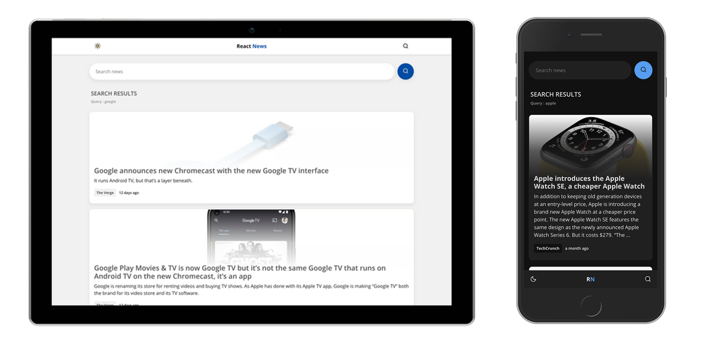

# News Search & Browsing app using React.js


## ▶️ Getting Started

1. Open terminal in your project directory

2. Clone the repo

```bash
git clone https://github.com/arunabharjun/reactjs-news.git
```

3. In your root directory, create a new file with the name ".env" and copy the following in that file

```
REACT_APP_THEME_KEY = darkMode
REACT_APP_NEWS_API_KEY = <YOUR_API_KEY_HERE>
REACT_APP_NEWS_API = https://newsapi.org/v2
REACT_APP_NEWS_API_ENDPOINT_HEADLINES = top-headlines
REACT_APP_NEWS_API_ENDPOINT_SEARCH = everything
```

4. Notice the **"REACT_APP_NEWS_API_KEY"** says **<YOUR_API_KEY_HERE>**

5. Lets create one.

## 🔑 Creating your API key from [https://newsapi.org/](https://newsapi.org/)

1. If you don't already have an account, visit the following link and create one.

[Register - News API](https://newsapi.org/register)

2. If you have an account, visit the following link and login

[Login - News API](https://newsapi.org/login)

3. Then visit the following link

[Account - News API](https://newsapi.org/account)

4. Copy the "API Key"

## 🌐 Setting up the environment variable for API Key

1. Go back to the root directory and in the ".env" file, replace "<YOUR_API_KEY_HERE>" with the API Key you copied from the previous step.

## ⬇️ Installing dependencies

1. Open terminal in the root directory and run the following command

```bash
npm install
```

## 🖥 Viewing the app

1. Start the react app

```bash
npm start
```

The app should have opened in your default browser, but if it didn't, visit [http://localhost:3000/](http://localhost:3000/)

## 🌟 Features

1. View top 10 headlines 
2. Search news
3. Change theme (Dark/Light)
4. Custom 404 error page
5. Responsive design
